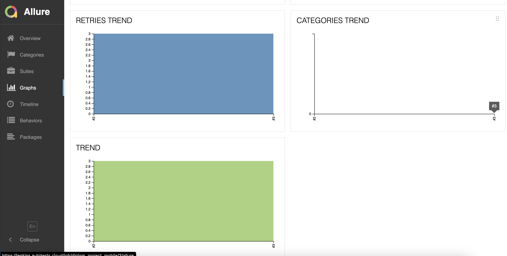
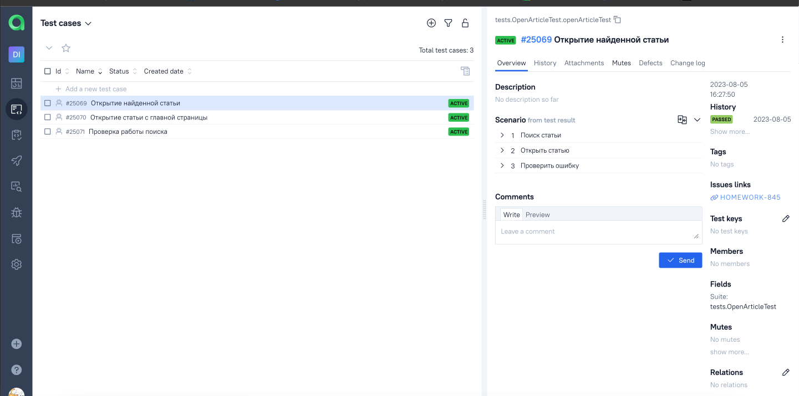

# Проект автоматизации Mobile тестирования для мобильного приложения Wikipedia


## **Содержание:**

____
* Технологии и инструменты
* Примеры автоматизированных тест-кейсов
* Сборка в Jenkins
* Запуск из терминала
* Allure отчет
* Интеграция с Allure TestOps
* Интеграция с JIRA
* Уведомления в Telegram при помощи бота
____

## <a name="Технологии и инструменты">**Технологии и инструменты:**</a>

<p align="center"> 
<a href="https://developer.android.com/"></a>
<a href="https://appium.io/"></a>
<a href="https://www.jetbrains.com/idea/"></a>  
<a href="https://selenide.org/">
<a href="https://www.java.com/"></a> 
<a href="https://www.browserstack.com/"></a>
<a href="https://github.com/"></a>  
<a href="https://junit.org/junit5/"></a>  
<a href="https://gradle.org/"></a>  
<a href="ht[images](images)tps://github.com/allure-framework/allure2"></a> 
<a href="https://qameta.io/"></a>   
<a href="https://www.jenkins.io/"></a>  
<a href="https://aerokube.com/selenoid/"></a>
<a href="https://www.atlassian.com/ru/software/jira/"></a>
</p>

___
## <a name="Примеры автоматизированных тест-кейсов">**Примеры автоматизированных тест-кейсов:**</a>
___
* ✓ *Открытие найденной статьи*
* ✓ *Открытие статьи с главной страницы*
* ✓ *Проверка работы поиска*

___

## </a><a name="Сборка"></a>Сборка в [Jenkins](https://jenkins.autotests.cloud/job/diplom_project_mobile/)</a>

___
<p align="center">
<a href="https://jenkins.autotests.cloud/job/diploma_project_web/"></a>

***Для локального запуска:***
```bash  
✓  Создать файл browserstack.properties и разместить по адресу src/test/resources/browserstack.properties
✓  Файл должен содержать следующие данные: 
- username=username для browserstack.com
- accessKey=accessKey юзер
- baseUrl=http://hub.browserstack.com/wd/hub
- appUrl=bs://c700ce60cf13ae8ed97705a55b8e022f13c5827c
- device=Google Pixel 3
- os_version=9.0
```
___
__
## </a> <a name="Allure"></a>Allure [отчет](https://jenkins.autotests.cloud/job/diplom_project_mobile/3/allure/)</a>

___

### *Основная страница отчёта*

<p align="center">  
  
</p>  

### *Тест-кейсы*

<p align="center">  
  
</p>

### *Графики*


  <p align="center">  
  
  
</p>

___

## </a>Интеграция с <a target="_blank" href="https://allure.autotests.cloud/project/3610/dashboards">Allure TestOps</a>
___

### *Allure TestOps Dashboard*

<p align="center">
  
</p>

### *Авто тест-кейсы*

<p align="center">  
  
</p>

___

## </a> Интеграция с <a target="_blank" href="https://jira.autotests.cloud/browse/HOMEWORK-845">Jira</a>
____
<p align="center">  
  
</p>

____

## </a> Уведомление в Telegram при помощи бота
____
<p align="center">  
  
</p>

____
____
## </a> Пример видео выполнения одного из тестов на Selenoid
____
<p align="center">
   
</p>